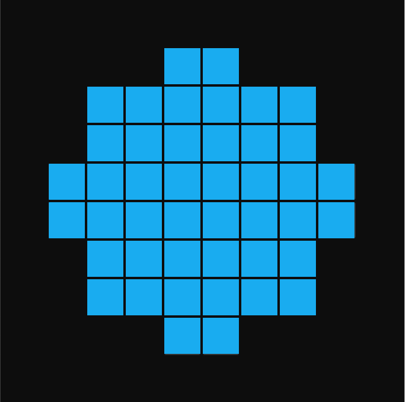
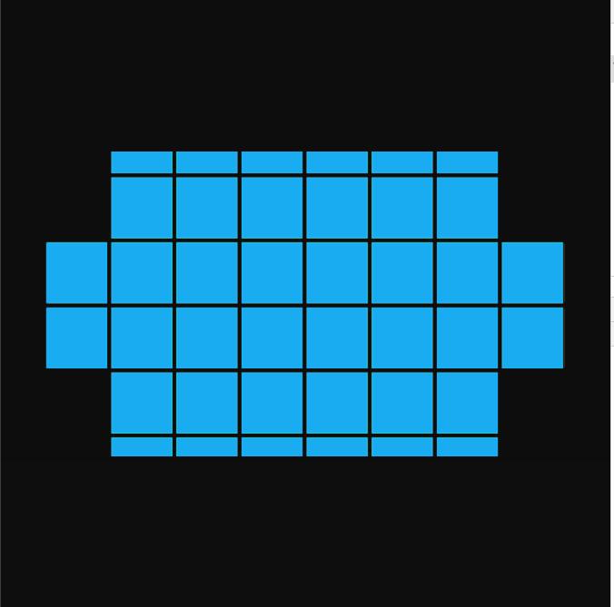
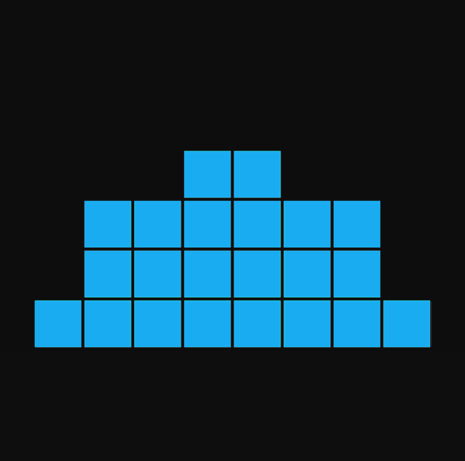
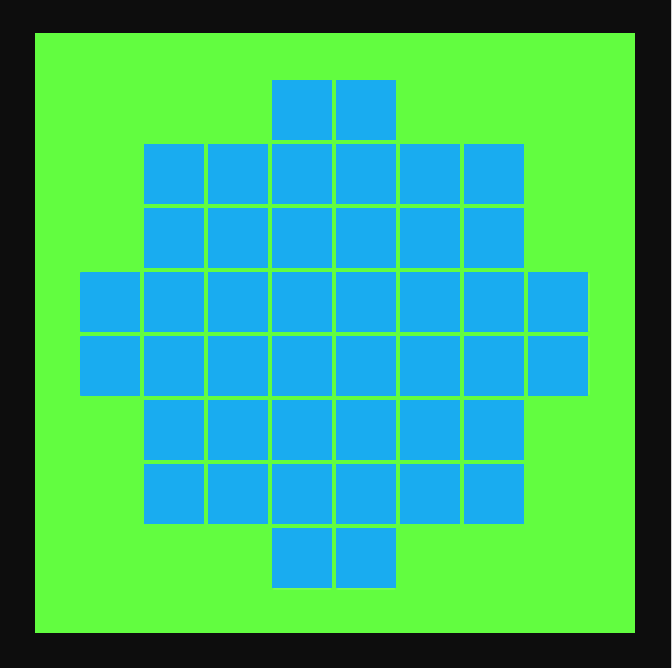
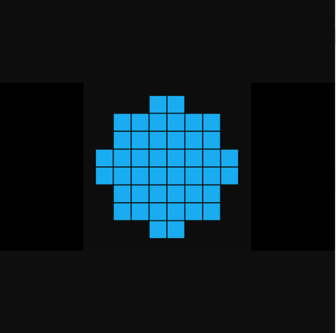
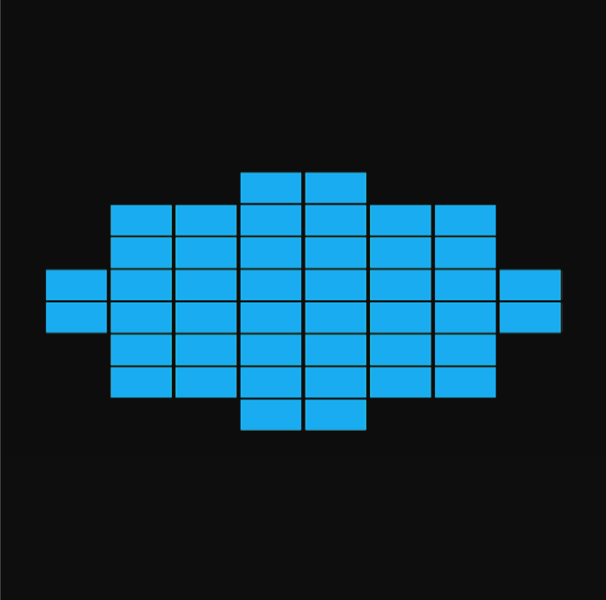
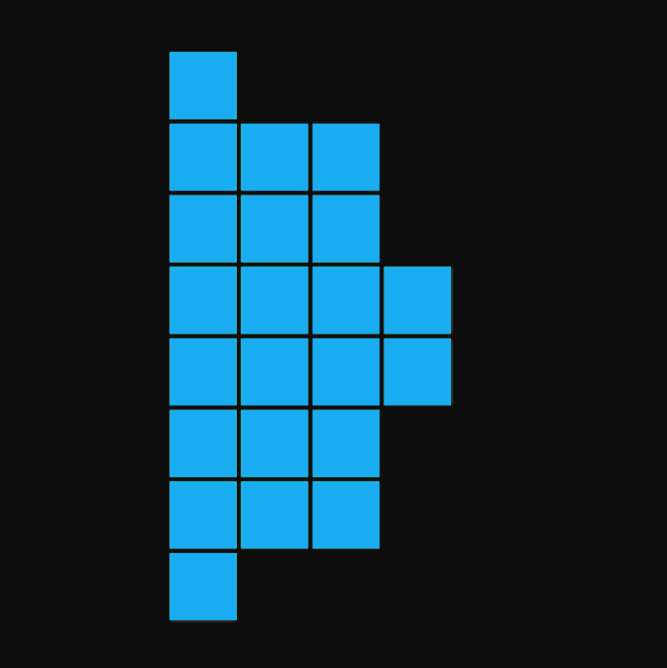

# EdgeFunctions Function Layout

An EdgeFunctions function must export a handler as the entry point for the application.  This function uses the standard naming convention of `index.handler`.

# Function Description

Image resize leveraging Sharp https://sharp.dimens.io/en/stable/

This module supports reading JPEG, PNG, WebP, TIFF, GIF and SVG images.

Output images can be in JPEG, PNG, WebP and TIFF formats as well as uncompressed raw pixel data.

This function requires installing and packaging mutiple node modules, which incldude Sharp, request, and hex-rgb. 
Each module can be installed using the following commands:
- $ npm install sharp
- $ npm install request
- $ npm install hex-rgb

## Request Paramters

required request parameters:

* url = original image url - url should NOT contain request parameters as they may cause conflicts with function

optional request parameters:

* fmt = format: string - options: 'png', 'jpeg', 'webp' and 'tiff' default is png
* fit = fit: string - options: 'cover', 'contain', 'fill', 'inside', 'outside', 'entropy', 'attention' default cover
* pos = position: string - options: 'centre' 'top' 'right' 'left' 'bottom' 'left,top' etc default 'centre'
* hex = hex: string - background color: 'ffffff,0.8'

## Returns

The function returns a binary buffer and status code 200 when successful.

The function returns status code 404 on failure.

## Sample Use

Create or update a function with the zip archive imageResize.zip.

Invoke the function using the sample requests below or with desired request parameters:

Sample image is a png with opaque cubes on a transparent surface

Original image:

Resize options: width: 700, height: 350, fit: cover

Sample Request: `{SHORT_NAME}/functions/{FUNCTION_NAME}/epInvoke/?url=http://global.mt.lldns.net/llnwstor/faas/images/faas-image-resize-sample.png&x=700&y=350`

Resize options: width: 700, height: 350, position: top

Sample Request: `{SHORT_NAME}/functions/{FUNCTION_NAME}/epInvoke/?url=http://global.mt.lldns.net/llnwstor/faas/images/faas-image-resize-sample.png&x=700&y=350&pos=top`

No resize options: background: green opaque

Sample Request: `{SHORT_NAME}/functions/{FUNCTION_NAME}/epInvoke/?url=http://global.mt.lldns.net/llnwstor/faas/images/faas-image-resize-sample.png&hex=69ff00,1`

Resize options: width: 700, height: 350, fit: contain

Sample Request: `{SHORT_NAME}/functions/{FUNCTION_NAME}/epInvoke/?url=http://global.mt.lldns.net/llnwstor/faas/images/faas-image-resize-sample.png&x=700&y=350&fit=contain`

Resize options: width: 700, height: 350, fit: contain, background: white opaque

Sample Request: `{SHORT_NAME}/functions/{FUNCTION_NAME}/epInvoke/?url=http://global.mt.lldns.net/llnwstor/faas/images/faas-image-resize-sample.png&x=700&y=350&fit=contain&hex=ffffff,1`

Resize options: width: 700, height: 350, fit: fill

Sample Request: `{SHORT_NAME}/functions/{FUNCTION_NAME}/epInvoke/?url=http://global.mt.lldns.net/llnwstor/faas/images/faas-image-resize-sample.png&x=700&y=350&fit=fill`

Resize options: width: 350, height: 700, pos: right

Sample Request: `{SHORT_NAME}/functions/{FUNCTION_NAME}/epInvoke/?url=http://global.mt.lldns.net/llnwstor/faas/images/faas-image-resize-sample.png&x=350&y=700&pos=right`

